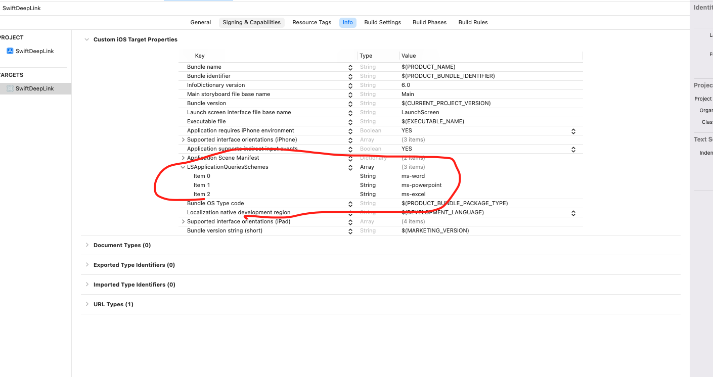

```swift
  guard let url = URL(string: "ms-word://") else { return }
  if UIApplication.shared.canOpenURL(url) {
      // deep link
      UIApplication.shared.open(url, options: [:], completionHandler: nil)
  } else {
      // upcell
      let vc = SKStoreProductViewController()
      // Value should app id on app store
      vc.loadProduct(withParameters: [SKStoreProductParameterITunesItemIdentifier: NSNumber(value: 586447913)], completionBlock: nil)
      present(vc, animated: true)
  }
```

```swift
//
//  ViewController.swift
//  SwiftDeepLink
//
//  Created by paige on 2022/01/14.
//

import StoreKit
import UIKit

class ViewController: UIViewController, UITableViewDataSource {

    let data = ["Terms", "Privacy", "Contact"]
    private let table = UITableView()

    override func viewDidLoad() {
        super.viewDidLoad()
        table.register(UITableViewCell.self, forCellReuseIdentifier: "cell")
        view.addSubview(table)
        table.dataSource = self
        table.tableFooterView = createFooter()
    }

    private func createFooter() -> UIView {
        let footer = UIView(frame: CGRect(x: 0, y: 0, width: view.frame.size.width, height: 100))
        footer.backgroundColor = .secondarySystemBackground
        let size = (view.frame.size.width - 40) / 3

        for x in 0..<3 {
            let button = UIButton(frame: CGRect(x: (CGFloat(x) * size) + (CGFloat(x) + 1 * 10), y: 0, width: size, height: size))
            footer.addSubview(button)
            button.tag = x + 1
            button.setBackgroundImage(UIImage(named: "app\(x+1)"), for: .normal)
            button.addTarget(self, action: #selector(didTapButton(_:)), for: .touchUpInside)
        }

        return footer
    }

    @objc private func didTapButton(_ sender: UIButton) {
        let tag = sender.tag
        switch tag {
        case 1:
            // word
            guard let url = URL(string: "ms-word://") else { return }
            if UIApplication.shared.canOpenURL(url) {
                // deep link
                UIApplication.shared.open(url, options: [:], completionHandler: nil)
            } else {
                // upcell
                let vc = SKStoreProductViewController()
                // Value should app id on app store
                vc.loadProduct(withParameters: [SKStoreProductParameterITunesItemIdentifier: NSNumber(value: 586447913)], completionBlock: nil)
                present(vc, animated: true)
            }
            break
        case 2:
            guard let url = URL(string: "ms-excel://") else { return }
            if UIApplication.shared.canOpenURL(url) {
                // deep link
                UIApplication.shared.open(url, options: [:], completionHandler: nil)
            } else {
                // upcell

            }
            break
        case 3:
            guard let url = URL(string: "ms-powerpoint://") else { return }
            if UIApplication.shared.canOpenURL(url) {
                // deep link
                UIApplication.shared.open(url, options: [:], completionHandler: nil)
            } else {
                // upcell

            }
            break
        default: break
        }
    }

    override func viewDidLayoutSubviews() {
        super.viewDidLayoutSubviews()
        table.frame = view.bounds
    }

    func tableView(_ tableView: UITableView, numberOfRowsInSection section: Int) -> Int {
        return data.count
    }

    func tableView(_ tableView: UITableView, cellForRowAt indexPath: IndexPath) -> UITableViewCell {
        let cell = tableView.dequeueReusableCell(withIdentifier: "cell", for: indexPath)
        cell.textLabel?.text = data[indexPath.row]
        return cell
    }


}
```
